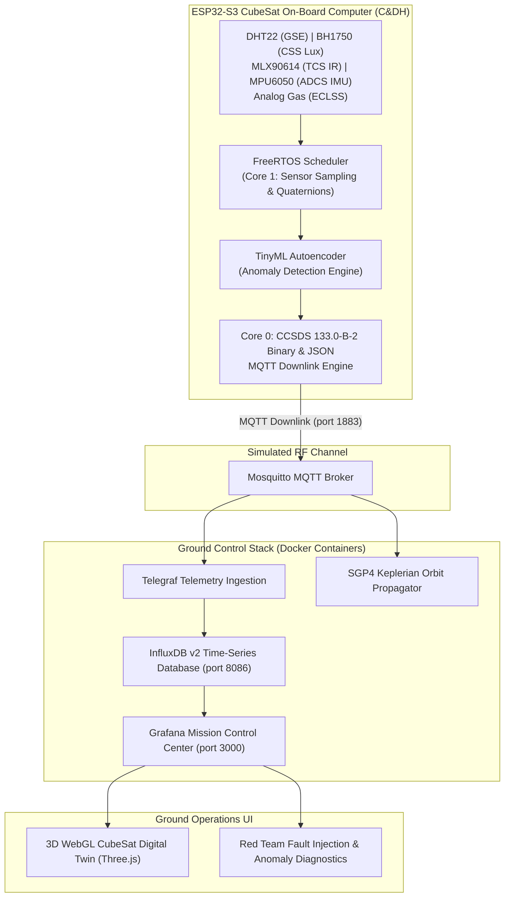

# Ru'ya SpacePoint Competition - ESP32-S3 CubeSat Telemetry & Ground Control System


This repository contains the complete flight software, ground segment infrastructure, 3D WebGL Digital Twin, and Red Team fault injection suite developed for the **Ru'ya SpacePoint Competition**.

It maps commercial IoT sensors (**DHT22**, **BH1750**, **MLX90614**, **MPU6050**, and an **Analog Gas Sensor**) connected to an **ESP32-S3** microcontroller acting as an **On-Board Computer (C&DH)** into functional space satellite subsystems (**ADCS**, **TCS**, **EPS**, **ECLSS**, and **GSE**).

---

## 🚀 System Architecture Overview



---

## 📡 Satellite Subsystem Mapping

| Sensor | Terrestrial Signal | Space Subsystem Analog | Functional Role & Educational Purpose |
| :--- | :--- | :--- | :--- |
| **ESP32-S3** | Dual-Core MCU | **C&DH (Command & Data Handling) / OBC** | FreeRTOS task scheduling, Mission Elapsed Time (MET), CCSDS packet framing, flight state machine. |
| **MPU6050** | 6-DOF IMU | **ADCS (Attitude Determination & Control)** | Detumbling detection, 3-axis angular velocity tracking ($\omega_x, \omega_y, \omega_z$), orientation quaternions ($q_0, q_1, q_2, q_3$). |
| **BH1750** | Ambient Light Lux | **ADCS / EPS (Coarse Sun Sensor - CSS)** | Orbital day/night (eclipse/penumbra) detection, solar array illumination monitoring. |
| **MLX90614** | Contactless IR Temp | **TCS (Thermal Control) & Payload** | Radiator surface temperature, non-contact thermal mapping payload, solar heating. |
| **DHT22** | Humidity & Ambient Temp | **GSE / Pre-Launch Testing** | Ground support equipment environmental verification prior to launch (vacuum context highlighted). |
| **Gas Sensor** | Analog Air Quality ADC | **ECLSS / Atmospheric Payload** | Environmental Control & Life Support System (cabin air quality monitoring for crewed modules/ISS). |

---

## 🛠️ Hardware Schematic & Pin Assignments

```
+-------------------------------------------------------------------------+
|                              ESP32-S3 OBC                               |
|                                                                         |
|   3.3V  GND  GPIO8(SDA)  GPIO9(SCL)   GPIO4(DHT)   GPIO1(Gas ADC)  5V   |
+----+-----+------+---------+------------+------------+---------------+---+
     |     |      |         |            |            |               |
     |     |      +----+----+            |            |               |
     |     |           |                 |            |               |
     |     |     +-----+-----+           |            |               |
     |     |     | I2C BUS   |           |            |               |
     |     |     | (3.3V)    |           |            |               |
     |     |     +-----+-----+           |            |               |
     |     |           |                 |            |               |
     +-----+-----------+---> BH1750      |            |               |
     |     |           |     (Addr 0x23) |            |               |
     |     |           |                 |            |               |
     +-----+-----------+---> MLX90614    |            |               |
     |     |           |     (Addr 0x5A) |            |               |
     |     |           |                 |            |               |
     +-----+-----------+---> MPU6050     |            |               |
     |     |                 (Addr 0x68) |            |               |
     |     |                             |            |               |
     +-----+-----------------------------+---> DHT22  |               |
     |     |                                   (10k pull-up)          |
     |     |                                          |               |
     +-----+------------------------------------------+---> Gas Sensor|
     |     |                                                (Signal)  |
     +-----+----------------------------------------------------------+---> (VCC 5V)
```

- **I2C Bus**: `GPIO 8` (SDA), `GPIO 9` (SCL) with 4.7kΩ pull-up resistors to 3.3V.
- **DHT22 Data**: `GPIO 4` with 10kΩ pull-up resistor to 3.3V.
- **Gas Sensor Signal**: `GPIO 1` (ADC1_CH0). *Ensure signal output is voltage-divided to 0–3.3V max!*
- **Gas Sensor Power**: `5V` (for heater element).

---

## 📁 Repository Directory Structure

```
Ruya Spacepoint Competition/
├── Ruya_SpacePoint_CubeSat/         # Arduino IDE Firmware Project
│   ├── Ruya_SpacePoint_CubeSat.ino  # Main Arduino sketch file
│   └── ccsds_telemetry.h            # CCSDS 133.0-B-2 binary header & struct definitions
├── platformio.ini                   # PlatformIO config & dependencies
├── include/ccsds_telemetry.h        # Shared CCSDS binary headers
├── src/main.cpp                     # Main C++ flight firmware source
├── ground_segment/                  # SGP4 Orbit & Pass Simulator
│   ├── Dockerfile                   # Docker image recipe for Python simulator
│   ├── requirements.txt             # Python dependencies (sgp4, paho-mqtt, numpy)
│   └── simulator.py                 # SGP4 orbit propagator & elevation pass calculator
├── mosquitto/                       # MQTT Broker Configurations
│   └── config/mosquitto.conf        # Mosquitto TCP (1883) & WebSockets (9001) setup
├── telegraf/                        # Telemetry Ingestion Configurations
│   └── telegraf.conf                # Telegraf MQTT JSON subscriber -> InfluxDB writer
├── grafana/                         # Grafana Mission Control Provisioning
│   ├── provisioning/
│   │   ├── datasources/influxdb.yaml # Automatic InfluxDB Flux datasource connector
│   │   └── dashboards/dashboards.yaml # Automatic dashboard auto-loader
│   └── dashboards/
│       └── threejs_digital_twin.html# 3D WebGL CubeSat Three.js orientation & heatmap
├── docs/                            # Competition & Instructor Manuals
│   └── INSTRUCTOR_GUIDE.md          # Wiring, Red Team commands, and viva rubric
├── docker-compose.yml               # Ground Control multi-container orchestrator
└── README.md                        # Project documentation (this file)
```

---

## ⚡ Getting Started: Quick Setup Guide

### 1. Flash the ESP32-S3 Flight Firmware

#### Option A: Using Arduino IDE (Recommended for Quick Edits)
1. Open **Arduino IDE** (v2.x recommended).
2. Go to **File -> Preferences** and add the ESP32 board URL:
   `https://espressif.github.io/arduino-esp32/package_esp32_index.json`
3. Install `esp32` by Espressif Systems in **Tools -> Board -> Boards Manager**.
4. Select `Tools -> Board -> esp32 -> ESP32S3 Dev Module`.
5. Install required libraries via **Tools -> Manage Libraries**:
   - `ArduinoJson` (v6.x)
   - `PubSubClient`
   - `DHT sensor library`
   - `BH1750`
   - `Adafruit MLX90614 Library`
   - `MPU6050` (by Electronic Cats)
6. Open [`Ruya_SpacePoint_CubeSat/Ruya_SpacePoint_CubeSat.ino`](file:///C:/Users/abhis/Documents/Spacepoint/Ruya%20SpacePoint%20Comp/New%20folder/Ruya%20Spacepoint%20Competition/Ruya_SpacePoint_CubeSat/Ruya_SpacePoint_CubeSat.ino).
7. Update `WIFI_SSID`, `WIFI_PASSWORD`, and `MQTT_SERVER` IP (your computer's local IP address).
8. Click **Upload** (`Ctrl + U`).

#### Option B: Using PlatformIO (VS Code)
```bash
pio run --target upload
```

---

### 2. Launch the Ground Control Station (Docker Compose)

Make sure Docker Desktop is installed and running on your computer, then execute:

```bash
docker compose up -d
```

Verify containers are running cleanly:
```bash
docker compose ps
```

---

### 3. Open Mission Control & 3D Digital Twin

1. **Grafana Mission Control Dashboard**:
   - Open your browser to `http://localhost:3000`
   - **Username**: `admin`
   - **Password**: `spacepoint`
2. **3D WebGL CubeSat Digital Twin**:
   - Open browser or embedded panel at `http://localhost:3000/public/threejs_digital_twin.html`
   - Renders live 3D orientation ($q_0, q_1, q_2, q_3$), surface thermal heat-maps, and eclipse lighting transitions synchronized with sensor readings.

---

## 🔴 Red Team Fault Injection Suite for Judges / Instructors

Instructors and judges can inject live flight failure anomalies into student telemetry streams using standard MQTT commands:

```bash
# Inject Fault 1: Satellite Tumbling State (High angular velocity spin)
mosquitto_pub -h localhost -t "spacepoint/commands/fault" -m "FAULT_01_TUMBLE"

# Inject Fault 2: Thermal Radiator Saturation (Spike MLX90614 reading to > 75°C)
mosquitto_pub -h localhost -t "spacepoint/commands/fault" -m "FAULT_02_THERMAL"

# Inject Fault 3: Avionics I2C Bus Lockup (Simulate sensor bus lockup)
mosquitto_pub -h localhost -t "spacepoint/commands/fault" -m "FAULT_03_I2C_LOCK"

# Inject Fault 4: ECLSS Cabin Gas Leak (Spike Gas sensor value to critical threshold)
mosquitto_pub -h localhost -t "spacepoint/commands/fault" -m "FAULT_04_ECLSS_LEAK"

# Reset All Faults to Nominal Mission State
mosquitto_pub -h localhost -t "spacepoint/commands/fault" -m "RESET_FAULTS"
```

---

## 🏆 Sample Competition Evaluation Criteria

1. **Space Systems Engineering (25%)**: C&DH state machine implementation, Mission Elapsed Time (MET), and CCSDS packet framing.
2. **Firmware Integrity & Multi-Tasking (20%)**: FreeRTOS task isolation across dual cores and I2C lockup recovery.
3. **Ground Control UX & 3D Digital Twin (20%)**: Grafana panel layout, alert thresholds, and 3D attitude rendering.
4. **Sensor Calibration & Edge AI (20%)**: Conversion to engineering units and TinyML anomaly detection score.
5. **Red Team Viva Defense (15%)**: Understanding space environment constraints (vacuum, radiation, thermal extremes).

---

## 📜 License & Credits

Developed for the **Ru'ya SpacePoint Competition**. Built with ❤️ for space tech educators, satellite engineers, and competition participants.
