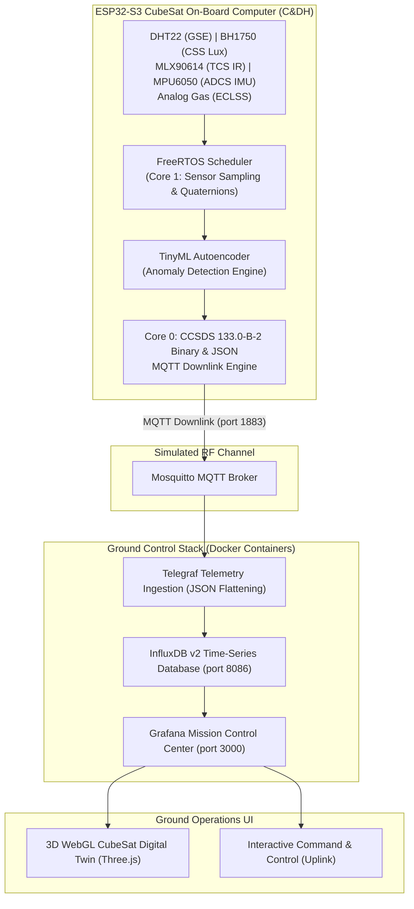

# Ru'ya SpacePoint Competition - ESP32-S3 CubeSat Telemetry & Ground Control System


This repository contains the complete flight software, ground segment infrastructure, 3D WebGL Digital Twin, and Red Team fault injection suite developed for the **Ru'ya SpacePoint Competition**.

It maps commercial IoT sensors (**DHT22**, **BH1750**, **MLX90614**, **MPU6050**, and an **Analog Gas Sensor**) connected to an **ESP32-S3** microcontroller acting as an **On-Board Computer (C&DH)** into functional space satellite subsystems (**ADCS**, **TCS**, **EPS**, **ECLSS**, and **GSE**).

---

## 🚀 System Architecture Overview



---

## 📡 Satellite Subsystem Mapping

| Sensor | Terrestrial Signal | Space Subsystem Analog | Functional Role & Educational Purpose |
| :--- | :--- | :--- | :--- |
| **ESP32-S3** | Dual-Core MCU | **C&DH (Command & Data Handling) / OBC** | FreeRTOS task scheduling, Mission Elapsed Time (MET), CCSDS packet framing, flight state machine. |
| **MPU6050** | 6-DOF IMU | **ADCS (Attitude Determination & Control)** | Detumbling detection, 3-axis angular velocity tracking ($\omega_x, \omega_y, \omega_z$), orientation quaternions ($q_0, q_1, q_2, q_3$). |
| **BH1750** | Ambient Light Lux | **ADCS / EPS (Coarse Sun Sensor - CSS)** | Orbital day/night (eclipse/penumbra) detection, solar array illumination monitoring. |
| **MLX90614** | Contactless IR Temp | **TCS (Thermal Control) & Payload** | Radiator surface temperature, non-contact thermal mapping payload, solar heating. |
| **DHT22** | Humidity & Ambient Temp | **GSE / Pre-Launch Testing** | Ground support equipment environmental verification prior to launch (vacuum context highlighted). |
| **Gas Sensor** | Analog Air Quality ADC | **ECLSS / Atmospheric Payload** | Environmental Control & Life Support System (cabin air quality monitoring for crewed modules/ISS). |

---

## 🛠️ Hardware Schematic & Pin Assignments

```
+-------------------------------------------------------------------------+
|                              ESP32-S3 OBC                               |
|                                                                         |
|   3.3V  GND  GPIO6(SDA)  GPIO7(SCL)   GPIO5(DHT)   GPIO4(Gas ADC)  5V   |
+----+-----+------+---------+------------+------------+---------------+---+
     |     |      |         |            |            |               |
     |     |      +----+----+            |            |               |
     |     |           |                 |            |               |
     |     |     +-----+-----+           |            |               |
     |     |     | I2C BUS   |           |            |               |
     |     |     | (3.3V)    |           |            |               |
     |     |     +-----+-----+           |            |               |
     |     |           |                 |            |               |
     +-----+-----------+---> BH1750      |            |               |
     |     |           |     (Addr 0x23) |            |               |
     |     |           |                 |            |               |
     +-----+-----------+---> MLX90614    |            |               |
     |     |           |     (Addr 0x5A) |            |               |
     |     |           |                 |            |               |
     +-----+-----------+---> MPU6050     |            |               |
     |     |                 (Addr 0x68) |            |               |
     |     |                             |            |               |
     +-----+-----------------------------+---> DHT22  |               |
     |     |                                   (10k pull-up)          |
     |     |                                          |               |
     +-----+------------------------------------------+---> Gas Sensor|
     |     |                                                (Signal)  |
     +-----+----------------------------------------------------------+---> (VCC 5V)
```

- **I2C Bus**: `GPIO 6` (SDA), `GPIO 7` (SCL).
- **DHT22 Data**: `GPIO 5` with 10kΩ pull-up resistor.
- **Gas Sensor Signal**: `GPIO 4` (ADC). *Ensure signal output is voltage-divided to 0–3.3V max!*

---

## ⚡ Getting Started: Quick Setup Guide

### 1. Flash the ESP32-S3 Flight Firmware

1. Open **Arduino IDE** (v2.x recommended).
2. Install required libraries: `ArduinoJson`, `PubSubClient`, `DHT sensor library`, `BH1750`, `Adafruit MLX90614 Library`, `MPU6050`.
3. Open [`Ruya_SpacePoint_CubeSat/Ruya_SpacePoint_CubeSat.ino`](./Ruya_SpacePoint_CubeSat/Ruya_SpacePoint_CubeSat.ino).
4. Update `WIFI_SSID`, `WIFI_PASSWORD`, and `MQTT_SERVER` IP (your computer's local IP address, e.g., Mobile Hotspot IP).
5. Click **Upload** (`Ctrl + U`).

---

### 2. Launch the Ground Control Station (Docker Compose)

Make sure Docker Desktop is installed and running, then execute:

```bash
docker compose up -d
```

---

### 3. Open Mission Control & 3D Digital Twin

1. **Grafana Mission Control Dashboard**:
   - Open your browser to `http://localhost:3000`
   - *Note: Anonymous viewing is enabled by default. No login is required for viewers/judges!*
   - To make edits, **Login:** `admin` / `spacepoint`
2. **Dashboard Generation**:
   - The Grafana JSON dashboard is auto-generated via Python using Flux queries mapping to Telegraf metrics.
3. **3D WebGL CubeSat Digital Twin**:
   - Embedded natively in the Grafana dashboard. Renders live 3D orientation ($q_0, q_1, q_2, q_3$), surface thermal heat-maps, and eclipse lighting transitions synchronized with real-time sensor readings.

---

## 🌍 Sharing the Dashboard with Judges (Remote & Local)

### Fast Local Network Sharing (In-Person Demo)
If the judges are in the same room, have them connect to your Mobile Wi-Fi Hotspot (e.g., `TinyGS-Network`) and type your laptop's IP address directly into their browser:
👉 `http://192.168.137.1:3000` *(Instant load, zero lag)*

### Remote Sharing (Cloudflare Tunnel)
If presenting remotely, start a free, high-speed Cloudflare tunnel from your PowerShell terminal:
```powershell
curl.exe -L "https://github.com/cloudflare/cloudflared/releases/latest/download/cloudflared-windows-amd64.exe" -o cloudflared.exe
.\cloudflared.exe tunnel --url http://localhost:3000
```
Share the `https://[random-words].trycloudflare.com` link printed in your terminal!

---

## 🔴 Red Team Fault Injection Suite & Command & Control

The 3D Digital Twin now features an integrated **Command & Control UI panel**! You no longer need to use CLI tools to inject faults. 

Directly from the Grafana dashboard, you can click buttons to instantly send uplink commands to the ESP32 via MQTT WebSockets:
*   **Inject Tumble:** Forces a simulated high-spin anomaly.
*   **Inject Thermal:** Spikes the MLX90614 reading to > 75°C.
*   **Inject ECLSS Leak:** Spikes the analog gas sensor value to a critical threshold.
*   **Reset All Faults:** Returns the spacecraft to nominal `NOMINAL_OPS` flight mode.

*(CLI fallback is still supported via `mosquitto_pub -h localhost -t "spacepoint/commands/fault" -m "FAULT_01_TUMBLE"`)*

---

## 🏆 Sample Competition Evaluation Criteria

1. **Space Systems Engineering (25%)**: C&DH state machine implementation, Mission Elapsed Time (MET), and CCSDS packet framing.
2. **Firmware Integrity & Multi-Tasking (20%)**: FreeRTOS task isolation across dual cores and I2C lockup recovery.
3. **Ground Control UX & 3D Digital Twin (20%)**: Grafana panel layout, automated Python generation, and 3D attitude rendering.
4. **Sensor Calibration & Edge AI (20%)**: Conversion to engineering units and TinyML anomaly detection score.
5. **Red Team Viva Defense (15%)**: Understanding space environment constraints and demonstrating bi-directional Command & Control uplink.

---

## 📜 License & Credits

Developed for the **Ru'ya SpacePoint Competition**. Built with ❤️ for space tech educators, satellite engineers, and competition participants.
